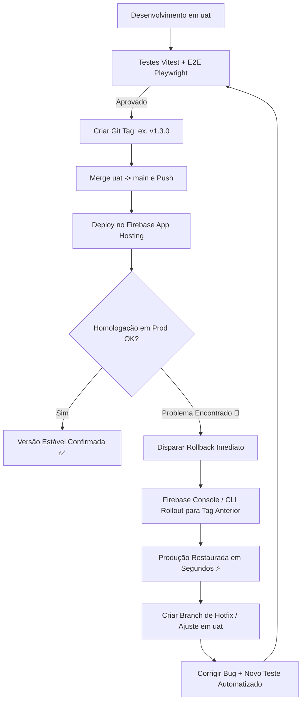
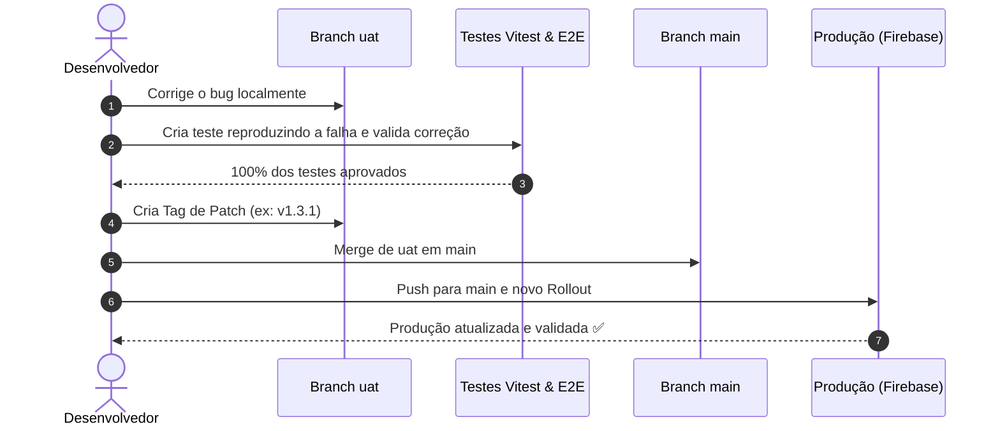

# Guia Operacional: Deploy Seguro, Rollback e Hotfix em Produção

Este documento estabelece o fluxo padrão para subir novas versões para a branch `main` (Produção / `numvapt.com`), reverter rapidamente em caso de incidentes e aplicar correções com rastreabilidade total.

---

## 🗺️ Visão Geral do Ciclo de Deploy e Rollback



---

## 🏷️ 1. Como Funciona o Versionamento por Tags em `main`

Toda vez que você pedir para subir para a branch `main`:
1. **Cálculo Automático da Próxima Tag:**
   - Se a última tag foi `v1.0.0`, a próxima será `v1.1.0` (novas funcionalidades) ou `v1.0.1` (correções).
2. **Criação da Tag no Commit de Merge em `main`:**
   - `git checkout main`
   - `git merge uat --no-ff -m "Release v1.X.X"`
   - `git tag -a v1.X.X -m "Release v1.X.X"`
   - `git push origin main --tags`
3. **Deploy no Firebase com a Tag:**
   - O Firebase App Hosting vincula o deploy diretamente à tag `v1.X.X`.

---

## ⏪ 2. Como Funciona o Comando de Rollback ("faça rollback em main")

Quando você pedir para **"fazer rollback em main"**:
1. **Identificação da Tag Anterior:**
   - O assistente lista as tags existentes e identifica a versão imediatamente anterior à atual (por exemplo, voltando de `v1.1.0` para `v1.0.0`).
2. **Reversão da Branch `main`:**
   - A branch `main` é revertida de forma limpa para o estado exato da tag anterior:
     ```bash
     git checkout main
     git revert -m 1 HEAD -m "Rollback para a tag estável v1.0.0"
     git push origin main
     ```
3. **Rollout Imediato em Produção:**
   - O tráfego de produção é redirecionado instantaneamente para o build correspondente à tag `v1.0.0`.
4. **Pronto para Ajustes em `uat`:**
   - A produção fica 100% segura na versão antiga enquanto você ajusta e testa na branch `uat`.
   - Ao finalizar a correção, basta pedir para subir novamente e uma nova tag (ex: `v1.1.1` ou `v1.2.0`) será criada e enviada para `main`.

---

## 🚨 2. Estratégia de Rollback Imediato (Caso ocorra erro em Prod)

Se um erro for detectado em produção após o deploy, você tem **duas opções** rápidas:

### ⚡ Opção A: Rollback Instantâneo via Firebase App Hosting (Recomendado - 30 segundos)
O Firebase App Hosting armazena todos os builds anteriores compilados. Você não precisa esperar um novo build acontecer para restaurar o site.

1. **Via Painel Web (Mais fácil e rápido):**
   - Acesse o [Console do Firebase](https://console.firebase.google.com/).
   - Vá em **App Hosting** ➔ Selecione seu backend (ex: `flowupinova` / `numvapt`).
   - Na aba **Rollouts**, localize o rollout anterior estável que estava funcionando (ex: da tag `v1.2.0`).
   - Clique no menu de três pontos (`...`) e selecione **"Rollback to this rollout"**.
   - O tráfego de produção volta imediatamente para a versão estável.

2. **Via Linha de Comando (Firebase CLI):**
   ```bash
   # Dispara um novo rollout apontando diretamente para o commit ou tag estável anterior
   npx firebase-tools apphosting:rollouts:create --git-ref v1.2.0 --backend flowupinova
   ```

---

### 🔄 Opção B: Rollback via Git (Rastreabilidade no Histórico)
Para garantir que a branch `main` no GitHub reflita a reversão do código:

```bash
# 1. Certifique-se de estar na branch main
git checkout main
git pull origin main

# 2. Crie um commit de reversão (desfaz as alterações do último merge de forma limpa)
git revert -m 1 HEAD -m "Revert: Rollback para estado estável anterior devido ao incidente X"

# 3. Envie a reversão para o repositório remoto
git push origin main
```

---

## 🛠️ 3. Fluxo de Ajuste (Hotfix) e Redespliegue

Após estabilizar a produção com o rollback, você pode corrigir a causa raiz sem pressa:



### Passo a passo para o Hotfix:
1. **Voltar para a branch `uat`:**
   ```bash
   git checkout uat
   ```
2. **Reproduzir e Corrigir o Bug:**
   - Crie um teste unitário ou E2E que falhe com o bug.
   - Aplique a correção no código até o teste passar.
3. **Validar novamente a suíte completa:**
   ```bash
   npm run test
   npm run test:e2e
   ```
4. **Gerar nova Tag de Patch (ex: `v1.3.1`):**
   ```bash
   git add .
   git commit -m "fix(posts): correção do bug X identificado no deploy anterior"
   git tag -a v1.3.1 -m "Release v1.3.1: Hotfix do bug X"
   ```
5. **Merge e Deploy para `main`:**
   ```bash
   git checkout main
   git merge uat --no-ff -m "Merge uat (Release v1.3.1 Hotfix) into main"
   git push origin main
   git push origin v1.3.1
   ```

---

## 📋 Resumo das Boas Práticas e Comandos Rápidos

| Ação | Comando Principal / Método |
| :--- | :--- |
| **Criar Tag de Versão** | `git tag -a v1.X.X -m "Mensagem da versão"` |
| **Listar Versões/Tags** | `git tag -n` |
| **Verificar Histórico com Tags** | `git log --oneline --graph --decorate -n 10` |
| **Rollback no Firebase** | Console do Firebase ➔ *App Hosting* ➔ *Rollouts* ➔ *Rollback* |
| **Rollback no Git** | `git revert -m 1 HEAD` |
| **Testar antes do Deploy** | `npm run test` && `npm run test:e2e` |
